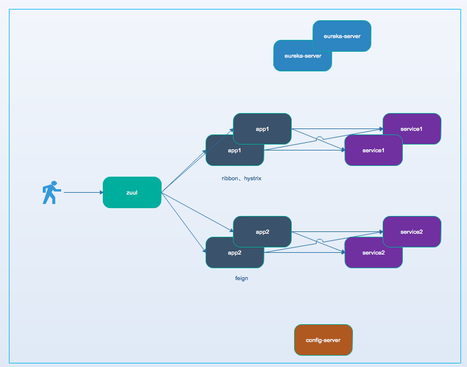

## 本地应用启动步骤

- 修改host：（为了避免在项目中写ip）
  ```
  127.0.0.1 eureka-server-peer1
  127.0.0.1 eureka-server-peer2
  127.0.0.1 eureka-server
  ```
- [启动 eureka-server](./spring-cloud-eureka-server/README.md)
- [启动 config-server](./spring-cloud-config-server/README.md)
- [启动 service1](./spring-cloud-service1/README.md)
- [启动 service2](./spring-cloud-service2/README.md)
- [启动 app1](./spring-cloud-app1/README.md)
- [启动 app2](./spring-cloud-app2/README.md)
- [启动 zuul](./spring-cloud-zuul/README.md)

## 搭建架构（持续更新）



## 一些注意点总结
- 关于spring.application.name和eureka.instance.appname：
    - 如果客户端（ribbon、feign）使用服务应用名（spring.application.name）请求，会请求该应用的所有实例
    - 如果客户端（ribbon、feign）使用服务实例名（eureka.instance.appname）请求，则请求该名称对应的实例
    - eureka.instance.appname可用于区分不同环境的服务、服务隔离等
    - spring.application.name可用于spring cloud config配置读取等
- spring cloud 应用启动完成后需要一段时间，服务才可用 
- 使用spring cloud config 配置时，config-repo中的参数优先级比命令行参数要高


## TODO
- feign客户端发送RequestBody类型请求参数
- 参数调优（请求超时时间、超时重试次数等）
- Spring DevTools 的使用：http://blog.csdn.net/isea533/article/details/70495714 （本地最高优先级全局配置等）
- zuul、config-server、eureka-server 集群高可用配置


